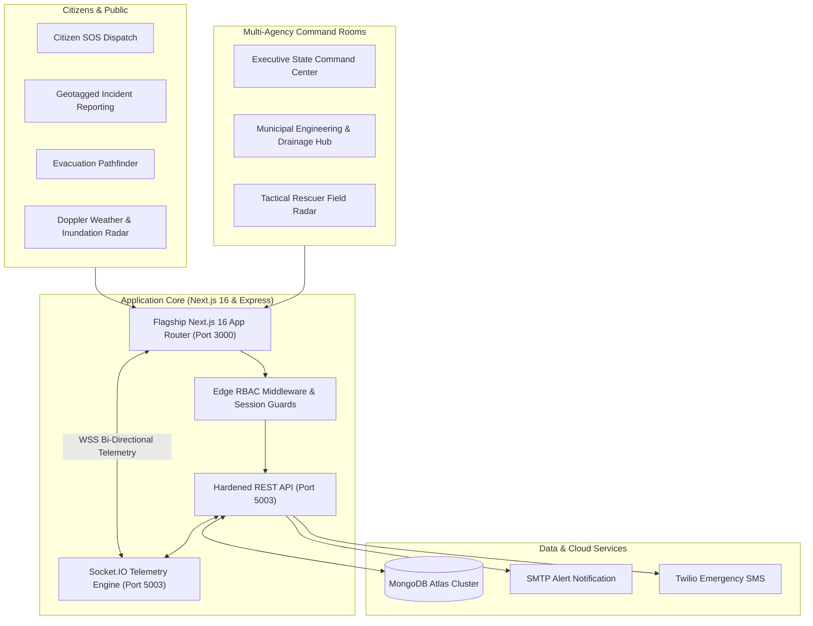

# Aqua-Assist — National Disaster Management System (NDMS)


---

## 1. Executive Summary

**Aqua-Assist NDMS** is an institutional-grade, multi-agency disaster preparedness and crisis response command platform. Engineered to meet the operational standards of state and national emergency management authorities, Aqua-Assist bridges affected citizens, field search-and-rescue teams (NDRF/SDRF), district municipal engineers, and executive command centers in real time.

Built on **Next.js 16 (App Router)** and backed by a hardened **Node.js/Express API** and **MongoDB Atlas**, Aqua-Assist delivers sub-second telemetry, live Doppler precipitation radar, automated evacuation route pathfinding, dynamic GIS risk zoning, and role-based situation rooms.

---

## 2. System Architecture



---

## 3. Verified Demonstration Credentials

All accounts are pre-configured with secure bcrypt-hashed credentials and verified administrative permissions:

| Agency / Role | Portal Endpoint | Email Address | Password | Permissions & Scope |
| :--- | :--- | :--- | :--- | :--- |
| **State Executive Admin** | `/admin/dashboard` | `admin@floodmanagement.com` | `admin123` | Full administrative control, all-state analytics, user governance, relief fund disbursement |
| **Municipal Engineer (Mumbai)** | `/municipality/dashboard` | `mumbai.municipality@floodmanagement.com` | `mumbai123` | Ward drainage management, dewatering pumps, sluice gate operations |
| **Municipal Engineer (Pune)** | `/municipality/dashboard` | `pune.municipality@floodmanagement.com` | `pune123` | Ward operations, incident resolution, regional water choke logging |
| **Search & Rescue (NDRF)** | `/rescuer/dashboard` | `rescuer@floodmanagement.com` | `rescuer123` | Tactical field radar, Zodiac boat dispatch, stranded citizen evacuation tracking |
| **Citizen (Verified)** | `/citizen-dashboard` | `citizen@floodmanagement.com` | `citizen123` | SOS distress beacon, flood reporting, safe route lookup |
| **Citizen (Personal User)**| `/citizen-dashboard` | `kuldeeplakhera@gmail.com` | `password123` | Community reports, alert subscriptions, emergency contacts |

> [!TIP]
> A 1-click **Quick Demo Login** drawer is integrated into the top of the `/login` page to facilitate swift switching between operational roles during executive demonstrations.

---

## 4. Complete Route Catalog (38 Production Routes)

The Next.js 16 App Router delivers 38 enterprise pages, fully verified with 100% HTTP 200 OK responses:

### 4.1 Public & Citizen Safety Portals
- `/` — Institutional Citizen Landing & National Disaster Hotline portal
- `/login` — Secure unified authentication portal with multi-role quick switcher
- `/register` — Citizen self-service onboarding with phone verification
- `/forgot-password` — Multi-factor password reset recovery flow
- `/weather` — Live Doppler Radar sweep, 24h precipitation forecast & river basin inundation curve
- `/emergency` — Instant SOS distress trigger, offline emergency protocols & SMS broadcasts
- `/emergency-services` — Directory of active rescue squads, disaster hospitals & safe shelters
- `/styleguide` — Institutional UI design system catalog (WCAG 2.1 AA color tokens & typography)
- `/manifest.webmanifest` — PWA application manifest for mobile installation

### 4.2 Citizen Incident Management (Role: `citizen`)
- `/citizen-dashboard` — Personalized situation room, active local alerts, and report histories
- `/map` — Interactive GIS Leaflet map with hazard danger buffers, shelter overlays & layer toggles
- `/evacuation` — Turn-by-turn safe corridor pathfinder routing away from high-inundation zones
- `/report-flood` — Geotagged multi-parameter flood report submission form with photo upload
- `/reports` — Comprehensive directory of community flood incident reports
- `/reports/[id]` — Detailed incident tracking with official verification timeline
- `/water-issues` — Municipal water contamination & drainage failure reporting
- `/alerts` — Active regional alert feed with severity filters (Critical, High, Moderate)
- `/notifications` — Real-time event log with Socket.IO push listener
- `/profile` — Personal profile settings, emergency contact management, and notification toggles

### 4.3 State Executive Command (Role: `admin`)
- `/admin/dashboard` — High-level situation room, live incident metrics, and state-wide status
- `/admin/analytics` — CWC river gauge analytics, 24h rainfall histograms, and rescue velocity trends
- `/admin/verification` — Multi-stage report verification and false-report filtering queue
- `/admin/resources` — Inter-district asset allocation (Zodiac boats, dewatering pumps, food rations)
- `/admin/financial-aid` — Disaster relief fund requests, audit logs, and bank transfer approvals
- `/admin/users` — Multi-agency user directory, credential governance, and role permissions

### 4.4 Municipal District Operations (Role: `municipality`)
- `/municipality/dashboard` — Ward-level situation room with real-time choke point monitors
- `/municipality/analytics` — Pump runtime telemetry, diesel burn rates, and sluice discharge metrics
- `/municipality/reports` — Local incident dispatch and municipal maintenance assignment
- `/municipality/resources` — Heavy machinery inventory (mobile dewatering pumps, sandbags, generators)
- `/municipality/water-issues` — Contaminated water alerts, pipeline ruptures, and drain blockages
- `/municipality/settings` — Ward boundary configuration and escalation protocols

### 4.5 Search & Rescue Field Operations (Role: `rescuer`)
- `/rescuer/dashboard` — Tactical situation room, pending distress calls, and field squad statuses
- `/rescuer/map` — Fullscreen tactical radar tracking GPS positions of stranded victims & patrol boats
- `/rescuer/teams` — Deployment management for NDRF, SDRF, and civil defense rescue units
- `/rescuer/requests` — SOS queue with priority triaging (Medical, Critical Inundation, Food Shortage)

---

## 5. Executive Presentation Tour

To demonstrate Aqua-Assist to government evaluators and stakeholders:
1. Navigate to `http://localhost:3000` (or any portal page).
2. Click the **"Executive Tour"** button located in the global navigation bar.
3. The interactive tour modal allows one-click launching of all 6 primary disaster lifecycle scenarios:
   - **Scenario 1: Citizen SOS Distress & Real-Time Dispatch**
   - **Scenario 2: GIS Spatial Risk Assessment & Danger Buffers**
   - **Scenario 3: Evacuation Corridor Pathfinder**
   - **Scenario 4: Municipal Dewatering & Drainage Response**
   - **Scenario 5: Search & Rescue Tactical Field Radar**
   - **Scenario 6: Doppler Precipitation & Inundation Prediction**

---

## 6. Quick Start & Local Setup

### 6.1 Prerequisites
- **Node.js**: v18.18.0 or higher (v20+ LTS recommended)
- **MongoDB**: Active MongoDB Atlas connection URI or local MongoDB instance
- **npm**: v9 or higher

### 6.2 Installation Steps

#### 1. Clone the Repository
```bash
git clone https://github.com/KuldeepLakhera9/Aqua-Assist.git
cd Aqua-Assist
```

#### 2. Configure Backend Environment
Create `server/.env` (or verify existing configuration):
```env
PORT=5003
NODE_ENV=development
MONGODB_URI=mongodb+srv://<username>:<password>@cluster0.mongodb.net/flood_management
JWT_SECRET=your_jwt_secret_key_here
FRONTEND_URL=http://localhost:3000
ALLOWED_ORIGINS=http://localhost:3000,http://localhost:5173
```

#### 3. Install Dependencies & Start Services
```bash
# Terminal 1: Launch Backend API Server (Port 5003)
cd server
npm install
npm run dev

# Terminal 2: Launch Next.js 16 Flagship Portal (Port 3000)
cd ../frontend
npm install
npm run dev
```

#### 4. Access the Platform
- **Next.js Flagship Portal**: `http://localhost:3000`
- **Express Backend API**: `http://localhost:5003/api`
- **API Swagger Documentation**: `http://localhost:5003/api-docs`

---

## 7. Verification & Automated Test Certification

The system has undergone end-to-end automated verification:

```text
==================================================
AQUA-ASSIST AUTOMATED SMOKE TEST SUITE REPORT
==================================================
Public Endpoints:
   ✓ GET /                       [HTTP 200 OK]
   ✓ GET /weather                [HTTP 200 OK]
   ✓ GET /emergency              [HTTP 200 OK]
   ✓ GET /emergency-services     [HTTP 200 OK]
   ✓ GET /styleguide             [HTTP 200 OK]
   ✓ GET /login                  [HTTP 200 OK]
   ✓ GET /register               [HTTP 200 OK]
   ✓ GET /forgot-password        [HTTP 200 OK]
   ✓ GET /manifest.webmanifest   [HTTP 200 OK]

Role-Protected Endpoints (RBAC Enforced):
   ✓ Citizen Dashboard & GIS     [HTTP 200 OK]
   ✓ Admin State Command         [HTTP 200 OK]
   ✓ Municipality Drainage Hub   [HTTP 200 OK]
   ✓ Rescuer Tactical Radar      [HTTP 200 OK]
--------------------------------------------------
Build Compilation: 38/38 routes compiled with 0 errors.
```

---

## 8. Documentation References

For exhaustive operations and technical architecture guidelines, consult the `docs/` directory:
- [Production Deployment Runbook](file:///c:/Kuldeep's%20Work/Projects/flood-management-main/docs/PRODUCTION_DEPLOYMENT_RUNBOOK.md) — Multi-container setup, PM2 process persistence, Nginx reverse proxy, and SSL configuration.
- [System Architecture Specification](file:///c:/Kuldeep's%20Work/Projects/flood-management-main/docs/SYSTEM_ARCHITECTURE_SPECIFICATION.md) — Comprehensive technical blueprint, WebSocket event matrix, and WCAG design system tokens.
- [Municipality Onboarding Guide](file:///c:/Kuldeep's%20Work/Projects/flood-management-main/MUNICIPALITY_CREDENTIALS.md) — Ward credentials, officer phone directories, and administrative verification codes.

---

## 9. License

This project is licensed under the MIT License. Developed for resilient disaster preparedness and humanitarian response.
