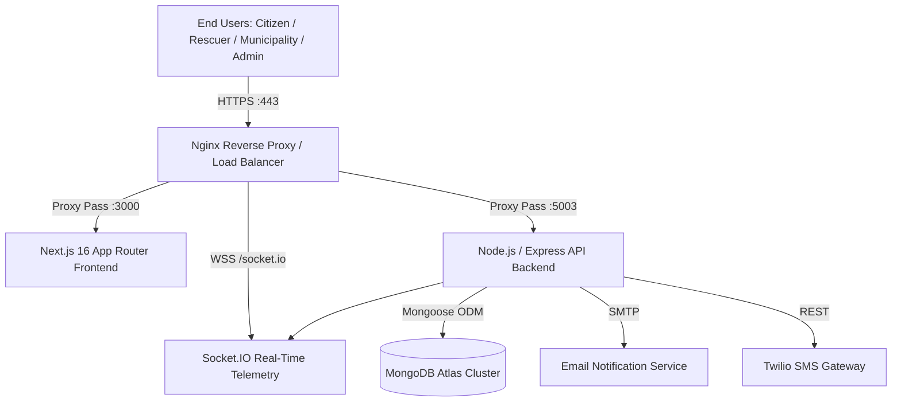

# Aqua-Assist NDMS — Production Deployment & Operations Runbook

## Executive Overview
**Aqua-Assist** is an enterprise-grade National Disaster Management System (NDMS) developed to unify multi-agency disaster preparedness, real-time crisis telemetry, citizen SOS dispatch, and spatial flood intelligence.

This runbook outlines the operational standards for deploying and managing the full stack in staging and production environments.

---

## 1. System Architecture & Topology



### Component Port Mapping
| Component | Runtime | Dev Port | Production Internal Port | Public URL / Path |
| :--- | :--- | :--- | :--- | :--- |
| **Flagship Portal (Frontend)** | Next.js 16 (Node.js 20+) | `3000` | `3000` | `https://disaster.gov.in/` |
| **API Server (Backend)** | Express 4.x (Node.js 20+) | `5003` | `5003` | `https://disaster.gov.in/api` |
| **WebSocket Engine** | Socket.IO 4.x | `5003` | `5003` | `wss://disaster.gov.in/socket.io` |
| **Legacy React Client** | Vite + React 18 | `5173` | N/A (Migrated) | Archived |

---

## 2. Environment Variables Configuration

### 2.1 Backend (`server/.env`)
Ensure the following variables are defined in production:

```env
# Server Configuration
PORT=5003
NODE_ENV=production
FRONTEND_URL=https://disaster.gov.in

# MongoDB Atlas Database URI
MONGODB_URI=mongodb+srv://<username>:<password>@cluster0.mongodb.net/flood_management?retryWrites=true&w=majority

# JSON Web Token Secret
JWT_SECRET=production_enterprise_jwt_secret_key_minimum_64_characters_long_sha256
JWT_EXPIRE=7d

# Socket.IO & CORS Whitelist
ALLOWED_ORIGINS=https://disaster.gov.in,http://localhost:3000

# Email Gateway (Nodemailer)
EMAIL_SERVICE=gmail
EMAIL_USER=alerts@floodmanagement.gov.in
EMAIL_PASS=app_specific_secure_password
EMAIL_FROM=NDMS National Disaster Alert System <alerts@floodmanagement.gov.in>

# SMS Gateway (Twilio)
TWILIO_ACCOUNT_SID=ACXXXXXXXXXXXXXXXXXXXXXXXXXXXXXXXX
TWILIO_AUTH_TOKEN=your_auth_token_here
TWILIO_PHONE_NUMBER=+1234567890
```

### 2.2 Frontend (`frontend/.env.local`)
Ensure the following variables are set for the Next.js App Router:

```env
# API & Telemetry Endpoints
NEXT_PUBLIC_API_URL=http://localhost:5003/api
NEXT_PUBLIC_SOCKET_URL=http://localhost:5003

# Application Metadata
NEXT_PUBLIC_APP_NAME="Aqua-Assist NDMS"
NEXT_PUBLIC_HOTLINE_NUMBER="1070"
```

---

## 3. Production Deployment Workflows

### 3.1 PM2 Process Manager (Recommended for Single/Multi-Core VPS)

#### Step 1: Install Global Process Manager
```bash
npm install -g pm2
```

#### Step 2: Build Next.js Production Bundle
```bash
cd frontend
npm ci
npm run build
```

#### Step 3: Configure Ecosystem File (`ecosystem.config.js`)
Create `ecosystem.config.js` in the project root:

```javascript
module.exports = {
  apps: [
    {
      name: "ndms-backend-api",
      cwd: "./server",
      script: "server.js",
      instances: 2,
      exec_mode: "cluster",
      env: {
        NODE_ENV: "production",
        PORT: 5003
      }
    },
    {
      name: "ndms-frontend-portal",
      cwd: "./frontend",
      script: "node_modules/next/dist/bin/next",
      args: "start -p 3000",
      instances: 2,
      exec_mode: "cluster",
      env: {
        NODE_ENV: "production",
        PORT: 3000
      }
    }
  ]
};
```

#### Step 4: Start and Persist Applications
```bash
pm2 start ecosystem.config.js
pm2 save
pm2 startup
```

---

## 4. Nginx Reverse Proxy & SSL Configuration

Deploy Nginx on Ubuntu/Debian (`/etc/nginx/sites-available/aqua-assist.conf`):

```nginx
server {
    listen 80;
    server_name disaster.gov.in;
    return 301 https://$host$request_uri;
}

server {
    listen 443 ssl http2;
    server_name disaster.gov.in;

    ssl_certificate /etc/letsencrypt/live/disaster.gov.in/fullchain.pem;
    ssl_certificate_key /etc/letsencrypt/live/disaster.gov.in/privkey.pem;
    ssl_protocols TLSv1.2 TLSv1.3;
    ssl_ciphers HIGH:!aNULL:!MD5;

    # Next.js Frontend Application
    location / {
        proxy_pass http://127.0.0.1:3000;
        proxy_http_version 1.1;
        proxy_set_header Upgrade $http_upgrade;
        proxy_set_header Connection 'upgrade';
        proxy_set_header Host $host;
        proxy_cache_bypass $http_upgrade;
        proxy_set_header X-Real-IP $remote_addr;
        proxy_set_header X-Forwarded-For $proxy_add_x_forwarded_for;
        proxy_set_header X-Forwarded-Proto $scheme;
    }

    # Node.js Express REST API
    location /api/ {
        proxy_pass http://127.0.0.1:5003/api/;
        proxy_http_version 1.1;
        proxy_set_header Host $host;
        proxy_set_header X-Real-IP $remote_addr;
        proxy_set_header X-Forwarded-For $proxy_add_x_forwarded_for;
        proxy_set_header X-Forwarded-Proto $scheme;
    }

    # Socket.IO Real-Time Engine
    location /socket.io/ {
        proxy_pass http://127.0.0.1:5003/socket.io/;
        proxy_http_version 1.1;
        proxy_set_header Upgrade $http_upgrade;
        proxy_set_header Connection "upgrade";
        proxy_set_header Host $host;
        proxy_cache_bypass $http_upgrade;
        proxy_set_header X-Real-IP $remote_addr;
        proxy_set_header X-Forwarded-For $proxy_add_x_forwarded_for;
    }
}
```

---

## 5. Automated Health Checks & Maintenance

### 5.1 Endpoint Health Probes
| Endpoint | Expected Status | Purpose |
| :--- | :--- | :--- |
| `GET /api/health` | `HTTP 200 OK` | Database and Express engine heartbeat |
| `GET /manifest.webmanifest` | `HTTP 200 OK` | PWA manifest validation |
| `GET /` | `HTTP 200 OK` | Citizen root landing SSR check |
| `GET /weather` | `HTTP 200 OK` | Doppler radar telemetry SSR check |

### 5.2 Database Backup Procedures (MongoDB Atlas)
- Continuous automated snapshotting enabled on MongoDB Atlas cluster.
- In-memory point-in-time recovery configured for 7-day retention.
- Command-line manual export:
  ```bash
  mongodump --uri="<MONGODB_URI>" --out=/var/backups/ndms/$(date +%F)
  ```

---

## 6. Disaster Recovery & Rollback Procedure
1. **Application Rollback**:
   ```bash
   git checkout <previous_stable_commit_tag>
   cd frontend && npm run build
   pm2 reload ecosystem.config.js
   ```
2. **Database Failover**:
   - Atlas multi-region automated replica set failover executes with sub-minute downtime.
