# Aqua-Assist NDMS — System Architecture Specification

## 1. System Mission & Scope
The **Aqua-Assist National Disaster Management System (NDMS)** provides a high-reliability, multi-tenant incident command and crisis mitigation platform. It links citizens in distress with district municipal engineers, search-and-rescue teams (NDRF/SDRF), and state disaster executive commanders.

---

## 2. Core Architectural Principles
1. **Zero-Latency Telemetry**: Bi-directional event bus built on WebSockets (`Socket.IO`) for immediate propagation of flash flood warnings, water-level threshold breaches, and SOS rescue dispatches.
2. **Defensive Route Security & RBAC**: Layered authorization with JSON Web Tokens, HTTP-only authentication cookies, Next.js server middleware guards, and MongoDB schema constraints.
3. **Institutional UI/UX Standard**: WCAG 2.1 AA compliant color contrast, strict typography hierarchy, keyboard navigability, high-visibility crisis banners, and multilingual localization (English, Hindi, Marathi).
4. **SSR-Safe GIS Spatial Processing**: Safe dynamic imports and decoupled geometric layers for Leaflet GIS, ensuring server-rendered stability without browser-window hydration errors.

---

## 3. Technology Stack Reference

```mermaid
graph LR
    subgraph Frontend["Flagship Next.js 16 Client (Port 3000)"]
        NextAppRouter["App Router (38 Routes)"]
        DesignSystem["Tailwind CSS v4 + Radix UI"]
        GISMap["Leaflet GIS & GeoJSON"]
        TelemetryCharts["Recharts Analytics"]
        SocketClient["Socket.IO Client"]
    end

    subgraph Backend["API & Event Core (Port 5003)"]
        Express["Express 4 REST API"]
        SocketEngine["Socket.IO Broadcast Rooms"]
        AuthMiddleware["JWT + Bcrypt Auth Guard"]
        MongoMongoose["Mongoose ODM Models"]
    end

    subgraph Infrastructure["Cloud Persistence & External Gateways"]
        Atlas["MongoDB Atlas Cluster"]
        Email["SMTP Nodemailer Alerts"]
        SMS["Twilio Emergency SMS"]
    end

    Frontend <-->|REST & WebSocket| Backend
    Backend <--> Infrastructure
```

---

## 4. Role-Based Access Control (RBAC) Architecture

| Role | Target Portal | Core Permissions | Primary Actions |
| :--- | :--- | :--- | :--- |
| **Super Admin** | `/admin/*` | Global system control, user moderation, analytics, resource redistribution | Audit municipal performance, manage system users, disburse disaster relief funds, view all-state telemetry. |
| **Municipality** | `/municipality/*` | District ward administration, pump stations, drainage choke points | Monitor water-logging reports, allocate dewatering pumps, resolve drain blockage tickets, update sluice gate status. |
| **Rescuer** | `/rescuer/*` | Tactical field operations, boat dispatch, distress beacon tracking | Accept citizen rescue requests, track GPS coordinates of stranded citizens, update mission status (`dispatched`, `on-scene`, `evacuated`). |
| **Citizen** | `/citizen-dashboard`, `/reports`, `/map` | SOS triggering, crowd-sourced flood reporting, safe route lookup | Submit geotagged flood reports, request emergency evacuation, view shelter occupancy, inspect live Doppler radar. |

### Middleware Route Enforcement
The Next.js edge middleware (`frontend/middleware.ts`) inspects the `ndms_auth_token` and `ndms_user_role` cookies:
- Unauthenticated requests to protected paths (`/admin/*`, `/municipality/*`, `/rescuer/*`, `/citizen-dashboard`, `/map`, `/evacuation`) redirect to `/login`.
- Role-mismatched requests are intercepted and redirected to their respective assigned situation rooms.

---

## 5. Real-Time Telemetry & WebSocket Event Matrix

| Event Name | Direction | Payload Structure | Action Triggered |
| :--- | :--- | :--- | :--- |
| `join-room` | Client &rarr; Server | `{ room: "district_mumbai" }` | Subscribes client socket to district-specific disaster channels. |
| `emergency-alert` | Server &rarr; Client | `{ id, title, severity, message, timestamp, affectedAreas }` | Broadcasts institutional flash alert modal and triggers audio sirens. |
| `new-flood-report` | Server &rarr; Client | `{ reportId, lat, lng, severity, description, timestamp }` | Spawns dynamic incident marker on `/map` and tactical rescuer radar. |
| `rescue-dispatched`| Server &rarr; Client | `{ missionId, teamName, etaMinutes, destinationCoords }` | Updates citizen evacuation dashboard with assigned boat/team status. |

---

## 6. Accessibility & Institutional Design Tokens (WCAG 2.1 AA)

- **Color Tokens**:
  - High-Risk Danger: `#DC2626` (Red 600) with `#FEF2F2` background (Contrast ratio > 7.1:1).
  - High-Alert Warning: `#D97706` (Amber 600) with `#FFFBEB` background.
  - Institutional Trust Blue: `#1E3A8A` (Blue 900) & `#2563EB` (Blue 600).
  - Surface Neutral: `#0B132B` (Dark Situation Room) & `#F8FAFC` (Light Portal).
- **Typography Hierarchy**:
  - Primary font family: `Inter, -apple-system, BlinkMacSystemFont, "Segoe UI", Roboto, sans-serif`.
  - Data telemetry counters: Monospaced high-legibility tabular numbers.
